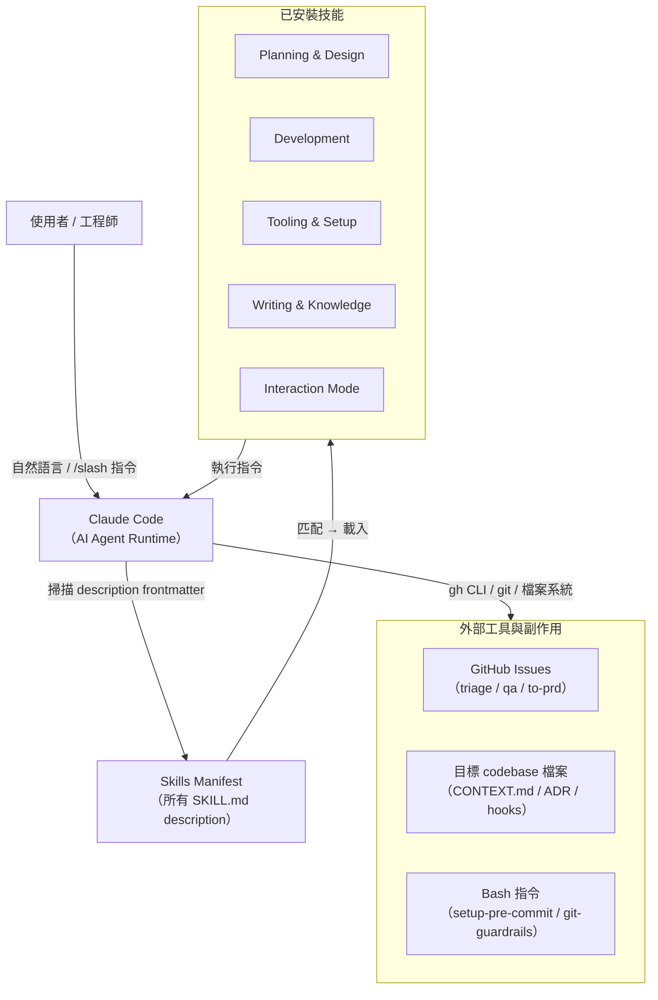
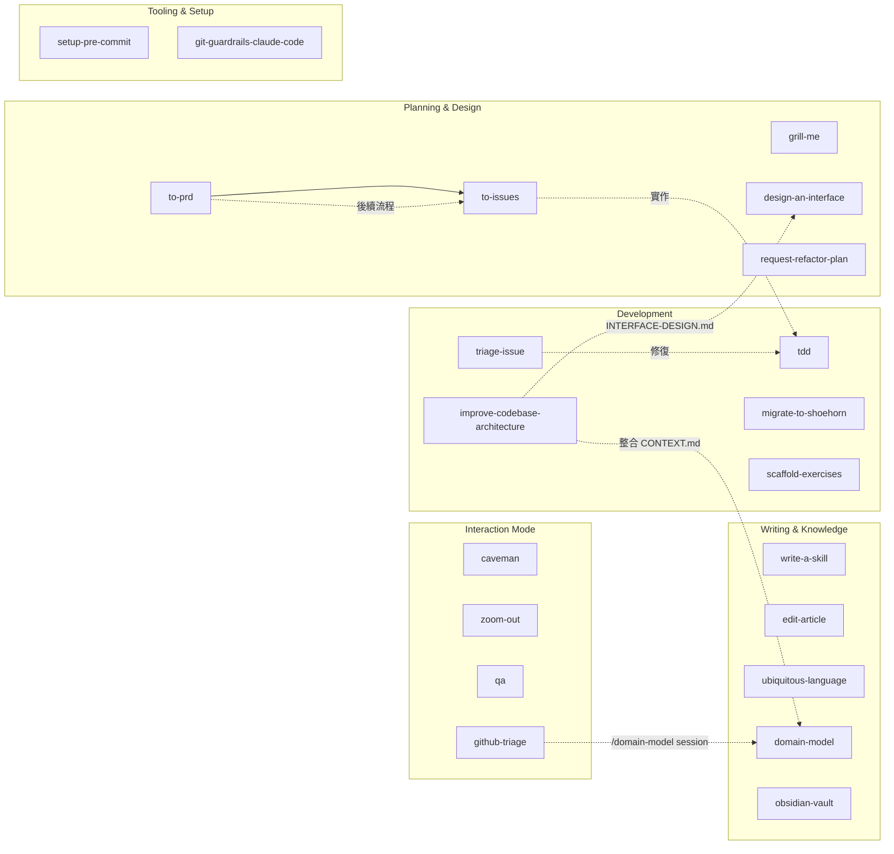
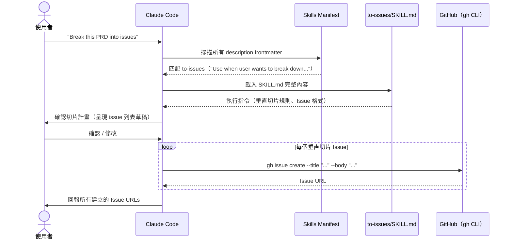
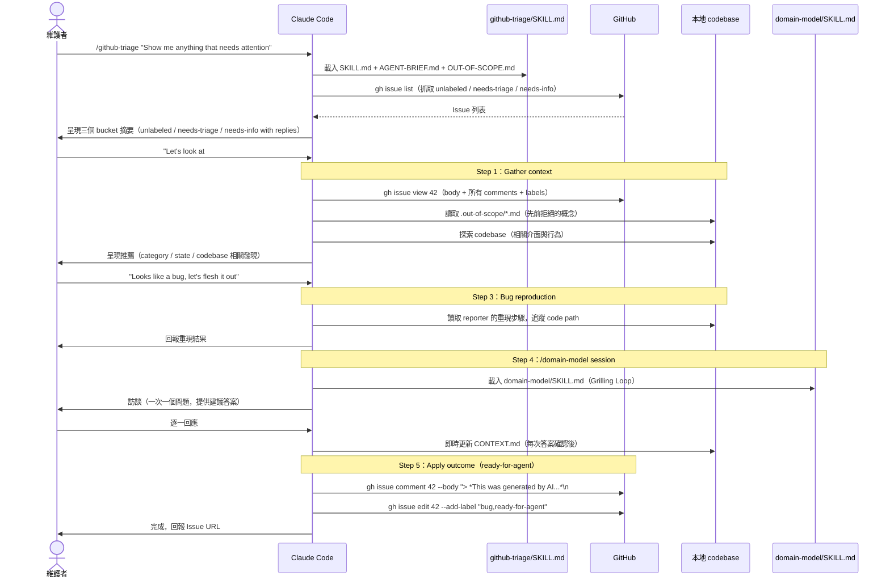

# mattpocock-skills 系統架構文件

> 文件版本：2026-04-29｜基礎版本：Git commit `90ea8ee`

---

## 1. 高層架構概覽

mattpocock-skills 是一個**純文件驅動的 Agent Skills 集合**，設計目標是讓 Claude Code 在不需要任何 runtime 程式碼的情況下，根據使用者意圖自動或手動載入對應技能並執行。



### 技能分類關係圖



---

## 2. 元件清單

### 2.1 核心元件：技能（Skill）

每個技能是一個獨立目錄，最小單元為 `SKILL.md`（YAML frontmatter + Markdown 執行指令）。

#### Planning & Design（規劃與設計）

| 技能 | 職責 | 關鍵檔案 | 上游觸發 | 下游副作用 |
|------|------|----------|----------|-----------|
| `to-prd` | 從對話 context 生成 PRD | `SKILL.md` | 使用者描述需求 | 建立 GitHub Issue |
| `to-issues` | 將 PRD 拆解為垂直切片 Issues | `SKILL.md` | `/to-prd` 輸出 | 建立多個 GitHub Issues |
| `grill-me` | 無情訪談，解決設計決策樹 | `SKILL.md` | 設計討論情境 | 無文件副作用 |
| `design-an-interface` | 平行 sub-agents 生成 3+ 種介面設計 | `SKILL.md` | 介面設計需求 | 無文件副作用 |
| `request-refactor-plan` | 建立重構計畫 | `SKILL.md` | 重構需求 | 建立 GitHub Issue |

#### Development（開發）

| 技能 | 職責 | 關鍵檔案 | 上游觸發 | 下游副作用 |
|------|------|----------|----------|-----------|
| `tdd` | TDD red-green-refactor 循環 | `SKILL.md`, `tests.md`, `mocking.md`, `interface-design.md`, `deep-modules.md`, `refactoring.md` | TDD 需求 / issue 實作 | 修改 codebase 程式碼與測試 |
| `triage-issue` | Bug 根因分析 + 修復計畫 | `SKILL.md` | Bug 報告 | 建立 GitHub Issue |
| `improve-codebase-architecture` | 找出淺模組深化機會 | `SKILL.md`, `DEEPENING.md`, `LANGUAGE.md`, `INTERFACE-DESIGN.md` | 架構改善需求 | 讀取 CONTEXT.md / ADR |
| `migrate-to-shoehorn` | 測試中 `as` 遷移至 shoehorn | `SKILL.md` | 型別斷言問題 | 修改測試檔案 |
| `scaffold-exercises` | 建立課程練習目錄結構 | `SKILL.md` | ai-hero.dev 課程需求 | 建立目錄結構 |

#### Tooling & Setup（工具與設定）

| 技能 | 職責 | 關鍵檔案 | 上游觸發 | 下游副作用 |
|------|------|----------|----------|-----------|
| `setup-pre-commit` | 設定 Husky + lint-staged + Prettier | `SKILL.md` | 設定 pre-commit 需求 | 修改 `package.json`、建立 `.husky/`、`.lintstagedrc`、`.prettierrc` |
| `git-guardrails-claude-code` | 攔截危險 git 指令的 PreToolUse hook | `SKILL.md`, `scripts/block-dangerous-git.sh` | 安全設定需求 | 建立 `.claude/hooks/`，修改 `.claude/settings.json` |

#### Writing & Knowledge（寫作與知識）

| 技能 | 職責 | 關鍵檔案 | 上游觸發 | 下游副作用 |
|------|------|----------|----------|-----------|
| `write-a-skill` | 建立新 skill 的元技能 | `SKILL.md` | 建立新技能需求 | 建立新技能目錄與 SKILL.md |
| `edit-article` | 重構文章章節 | `SKILL.md` | 文章改善需求 | 修改文章檔案 |
| `ubiquitous-language` | 萃取 DDD 通用語言術語表 | `SKILL.md` | `/ubiquitous-language` 手動觸發 | 寫入 `UBIQUITOUS_LANGUAGE.md` |
| `domain-model` | 領域模型訪談 + CONTEXT.md 維護 | `SKILL.md`, `ADR-FORMAT.md`, `CONTEXT-FORMAT.md` | `/domain-model` 手動觸發 | 建立/更新 `CONTEXT.md`、`docs/adr/` |
| `obsidian-vault` | 管理 Obsidian 筆記庫 | `SKILL.md` | Obsidian 操作需求 | 建立/修改筆記檔案 |

#### Interaction Mode（互動模式）

| 技能 | 職責 | 關鍵檔案 | 上游觸發 | 下游副作用 |
|------|------|----------|----------|-----------|
| `caveman` | 超壓縮溝通模式（~75% token 節省） | `SKILL.md` | "less tokens" 等關鍵詞 | 無 |
| `zoom-out` | 讓 agent 提升抽象層次 | `SKILL.md` | `/zoom-out` 手動觸發 | 無 |
| `qa` | 互動式 QA 會話 + 自動建立 Issues | `SKILL.md` | QA 情境 | 建立 GitHub Issue(s) |
| `github-triage` | GitHub Issue 分類狀態機 | `SKILL.md`, `AGENT-BRIEF.md`, `OUT-OF-SCOPE.md` | Issue 管理需求 | label 變更、建立評論、`.out-of-scope/*.md` |

### 2.2 輔助文件（Support Documents）

輔助文件放置於技能目錄下，是 SKILL.md 的延伸，存放超過 100 行的複雜細節：

| 文件 | 所屬技能 | 角色 |
|------|----------|------|
| `tdd/tests.md` | `tdd` | 好測試 vs 壞測試具體範例 |
| `tdd/mocking.md` | `tdd` | Mock 使用時機與介面設計指南 |
| `tdd/interface-design.md` | `tdd` | 可測試介面設計原則 |
| `tdd/deep-modules.md` | `tdd` | Ousterhout 深度模組概念 |
| `tdd/refactoring.md` | `tdd` | 重構候選項目清單 |
| `domain-model/ADR-FORMAT.md` | `domain-model` | ADR 格式規範（跨技能共用） |
| `domain-model/CONTEXT-FORMAT.md` | `domain-model` | CONTEXT.md 格式規範 |
| `github-triage/AGENT-BRIEF.md` | `github-triage` | 如何撰寫耐久性 agent brief |
| `github-triage/OUT-OF-SCOPE.md` | `github-triage` | `.out-of-scope/` 知識庫說明 |
| `improve-codebase-architecture/DEEPENING.md` | `improve-codebase-architecture` | 依賴分類與深化策略 |
| `improve-codebase-architecture/LANGUAGE.md` | `improve-codebase-architecture` | 共用架構詞彙表 |
| `improve-codebase-architecture/INTERFACE-DESIGN.md` | `improve-codebase-architecture` | 介面設計子流程整合 |
| `git-guardrails-claude-code/scripts/block-dangerous-git.sh` | `git-guardrails-claude-code` | 唯一的可執行 bash script（PreToolUse hook） |

---

## 3. 分層設計與 Module Boundary

每個技能由三層組成，形成清晰的職責邊界：

```
┌─────────────────────────────────────────────────────┐
│  Layer 1：Frontmatter 層（元資料）                    │
│  ─ name: 技能識別符，與目錄名稱一致                    │
│  ─ description: ≤1024 字元，Claude 選擇載入的唯一依據  │
│  ─ disable-model-invocation: 控制觸發模式              │
├─────────────────────────────────────────────────────┤
│  Layer 2：指令層（執行邏輯）                           │
│  ─ SKILL.md 本體，≤100 行                            │
│  ─ 包含工作流程、規則、checklist                       │
│  ─ 參照輔助文件（[REFERENCE.md](REFERENCE.md)）       │
├─────────────────────────────────────────────────────┤
│  Layer 3：輔助文件層（參考資料）                       │
│  ─ 獨立 .md 文件（tests.md、DEEPENING.md 等）         │
│  ─ 可執行 script（scripts/*.sh）                      │
│  ─ 按需載入，避免每次消耗過多 tokens                   │
└─────────────────────────────────────────────────────┘
```

### 各分類技能的邊界規則

- **Planning & Design** 技能：只輸出 GitHub Issues 或訪談對話，不直接修改 codebase。
- **Development** 技能：直接操作 codebase 程式碼，使用 sub-agent 探索與分析。
- **Tooling & Setup** 技能：修改開發工具設定（hooks、package.json），通常只需執行一次。
- **Writing & Knowledge** 技能：`domain-model` 和 `ubiquitous-language` 因有持久性文件副作用，強制使用 `disable-model-invocation: true`。
- **Interaction Mode** 技能：`caveman` 與 `zoom-out` 改變 Claude 的行為模式；`github-triage` 是最複雜的狀態機，跨越 Planning、Knowledge、外部工具三個領域。

---

## 4. 通訊模式

### 4.1 Claude Code 如何選擇載入技能

Claude Code 在系統啟動時讀取所有已安裝技能的 `description` frontmatter，注入至 system prompt。每次對話回合，Claude 根據使用者輸入與 description 進行語意匹配，自動選擇最符合的技能載入。

```
description frontmatter = 技能對外的唯一介面
                        = Claude 選擇技能的唯一判斷依據
```

`write-a-skill/SKILL.md` 明確規定 description 格式：
- 第一句：說明技能能力（what）
- 第二句：`"Use when [specific triggers]"`（when/why）
- 上限 1024 字元（Claude Code 硬性限制）

### 4.2 技能間如何「通訊」

技能間沒有程式 API，通訊方式是**文件驅動的文字參照**：

- `github-triage/SKILL.md` 指令：「Want to flesh it out → start a `/domain-model` session」
- `improve-codebase-architecture/SKILL.md` 透過 `INTERFACE-DESIGN.md` 描述如何整合 `/design-an-interface`
- `to-issues/SKILL.md` 建議後續使用 `/tdd` 實作每個 issue

這種設計意味著技能組合是透過**使用者流程**串連，而非程式呼叫鏈。

### 4.3 技能的副作用機制

技能執行後的持久化輸出分為三類：

| 副作用類型 | 機制 | 代表技能 |
|-----------|------|----------|
| **GitHub 物件** | `gh` CLI 建立 Issue / label / comment | `to-prd`、`to-issues`、`qa`、`github-triage`、`triage-issue` |
| **codebase 文件** | 直接寫入 Markdown 文件 | `domain-model` → `CONTEXT.md`、`ubiquitous-language` → `UBIQUITOUS_LANGUAGE.md`、`github-triage` → `.out-of-scope/*.md` |
| **工具設定** | 修改設定檔案或建立 script | `setup-pre-commit` → `.husky/`、`git-guardrails-claude-code` → `.claude/settings.json` |

---

## 5. Sequence Diagrams

### 流程 1：使用者觸發技能 → Claude 執行 → 產生輸出

以 `to-issues` 為例，展示自動觸發的完整生命週期：



### 流程 2：`github-triage` 完整 Issue 分類流程



---

## 6. 關鍵設計決策與 Trade-off

### 決策 1：為何選擇純 Markdown 而非程式碼

**決策**：整個 repo 除一個 bash hook script 外，全部採用 Markdown 格式。

**理由**：
- Claude Code 直接解讀 Markdown 指令，無需解析或編譯步驟
- 降低維護門檻：任何工程師可直接閱讀、修改技能
- 可移植性：同一份 SKILL.md 理論上可適用於支援 skill 格式的不同 agent 平台
- 版本控管友善：文字 diff 一目了然

**Trade-off**：
- 無法做型別檢查或靜態分析
- 指令的「正確性」完全依賴 LLM 的理解能力
- 複雜邏輯（如狀態機）需要大量散文描述，而非程式碼的精確規格

### 決策 2：`disable-model-invocation` 機制

**決策**：`domain-model`、`ubiquitous-language`、`zoom-out` 設定 `disable-model-invocation: true`，只允許手動 `/slash` 觸發。

**理由**：
- **副作用性**：`domain-model` 會修改整個 team 共用的 `CONTEXT.md` 和 ADR 文件，時機必須由人類決定
- **意圖明確性**：`zoom-out` 會改變 Claude 的行為模式，需要使用者有明確意圖
- **防止誤觸發**：若 Claude 在一般對話中自動觸發 `domain-model`，可能在錯誤時機寫入不正確的領域知識

**Trade-off**：使用者必須知道這些技能存在且記得手動呼叫，降低了可發現性（discoverability）。

### 決策 3：垂直切片（Tracer Bullet）vs 水平切片

**決策**：`tdd/SKILL.md` 明確禁止水平切片，強制要求垂直切片（每次 RED→GREEN 完成一個完整行為）。

**理由**：
- 水平切片（先寫所有測試，再寫所有實作）會導致測試在不了解實作的情況下被「想像」出來
- 垂直切片確保每個測試都是回應真實行為，而非假設性結構
- 每個切片是可展示、可驗證的完整功能片段

**Trade-off**：垂直切片需要更頻繁的規劃對話（每個切片前確認介面），但結果是更有意義的測試套件。

### 決策 4：Progressive Disclosure 結構（SKILL.md ≤100 行）

**決策**：`write-a-skill/SKILL.md` 規定主要指令檔案不超過 100 行，複雜細節強制抽取至獨立輔助文件。

**理由**：
- 縮短「description 匹配 → 核心指令」的讀取路徑，減少 token 消耗
- 輔助文件只在需要時由指令中的連結引用載入（lazy loading）
- `tdd` 技能的 5 個輔助文件（tests.md、mocking.md 等）就是最佳示範：主流程清晰，細節按需參閱

**Trade-off**：多文件結構增加了目錄複雜度；輔助文件的內容需手動與 SKILL.md 保持同步，無自動驗證機制。

---

*此文件由 Claude Code 根據 `.trace/_context/` 偵察報告自動生成。*
