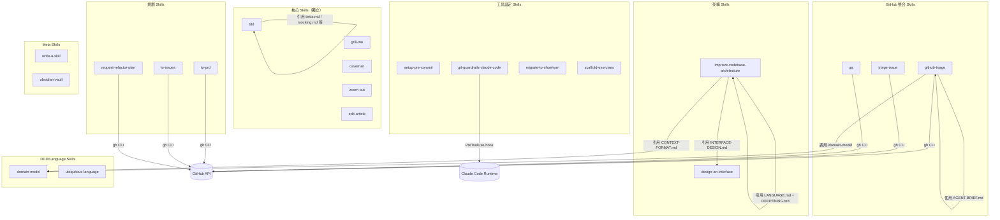

# CODEBASE_MAP.md — 程式碼地圖

## Annotated Directory Tree

```
mattpocock-skills/
│
├── README.md                    ← 所有 skills 的索引（部分 skills 未列入，見 DISCOVERY_LOG）
├── LICENSE                      ← MIT，Copyright 2026 Matt Pocock
│
├── caveman/
│   └── SKILL.md                 ← 壓縮溝通模式 skill（disable-model-invocation 類型）
│
├── design-an-interface/
│   └── SKILL.md                 ← 平行 sub-agent 介面設計，引用 "Design It Twice" 原則
│
├── domain-model/
│   ├── SKILL.md                 ← DDD grilling，disable-model-invocation 類型
│   ├── ADR-FORMAT.md            ← ADR 格式規範（供 domain-model 和 improve-codebase 引用）
│   └── CONTEXT-FORMAT.md       ← CONTEXT.md 格式規範（DDD 術語表格式）
│
├── edit-article/
│   └── SKILL.md                 ← 文章按段落重寫，使用 directed acyclic graph 排序概念
│
├── git-guardrails-claude-code/
│   ├── SKILL.md                 ← 安裝 PreToolUse hook 的指南
│   └── scripts/
│       └── block-dangerous-git.sh  ← 唯一的可執行腳本，攔截危險 git 指令
│
├── github-triage/
│   ├── SKILL.md                 ← label 狀態機 + workflow（最複雜的 skill，169 行）
│   ├── AGENT-BRIEF.md           ← agent brief 寫作規範（durability 原則）
│   └── OUT-OF-SCOPE.md         ← .out-of-scope/ 知識庫說明與格式
│
├── grill-me/
│   └── SKILL.md                 ← 10 行超簡潔，「無情審問直到共識」
│
├── improve-codebase-architecture/
│   ├── SKILL.md                 ← 主流程（77 行）
│   ├── DEEPENING.md             ← 深化策略（依賴分類：in-process/local/remote/external）
│   ├── INTERFACE-DESIGN.md      ← 平行 sub-agent 介面設計（用於架構 skill 的 step 3）
│   └── LANGUAGE.md              ← 架構術語表（module/interface/depth/seam/adapter 等）
│
├── migrate-to-shoehorn/
│   └── SKILL.md                 ← TypeScript 測試 `as` → shoehorn 遷移，附程式碼範例
│
├── obsidian-vault/
│   └── SKILL.md                 ← Obsidian 操作（硬編碼個人路徑，需修改）
│
├── qa/
│   └── SKILL.md                 ← 互動 QA session，背景探索 + issue 分解
│
├── request-refactor-plan/
│   └── SKILL.md                 ← 重構計畫 RFC，Martin Fowler 引述
│
├── scaffold-exercises/
│   └── SKILL.md                 ← aihero.dev 課程練習結構生成（環境特定）
│
├── setup-pre-commit/
│   └── SKILL.md                 ← Husky v9+ + lint-staged + prettier 設置
│
├── tdd/
│   ├── SKILL.md                 ← 主流程（108 行，含 5 個連結）
│   ├── deep-modules.md          ← 深/淺模組視覺說明
│   ├── interface-design.md      ← 可測試介面的 3 個原則
│   ├── mocking.md               ← 系統邊界 mock 策略
│   ├── refactoring.md           ← 重構候選模式列表
│   └── tests.md                 ← 好/壞測試範例（TypeScript）
│
├── to-issues/
│   └── SKILL.md                 ← 計畫拆分為垂直切片 GitHub issues
│
├── to-prd/
│   └── SKILL.md                 ← 對話/codebase 探索 → PRD GitHub issue
│
├── triage-issue/
│   └── SKILL.md                 ← Bug 偵查 + TDD 計畫 → GitHub issue（103 行）
│
├── ubiquitous-language/
│   ├── SKILL.md                 ← DDD 術語表提取，disable-model-invocation 類型
│   └── （輸出）UBIQUITOUS_LANGUAGE.md ← 由 skill 生成，放在使用者的 repo 根目錄
│
├── write-a-skill/
│   └── SKILL.md                 ← 新 skill 建立指南（meta-skill）
│
└── zoom-out/
    └── SKILL.md                 ← 3 行，disable-model-invocation 類型
```

---

## 「我想改 X 要看哪裡？」速查表

| 我想要...                          | 看這裡                                        | 關鍵檔案 |
|------------------------------------|----------------------------------------------|---------|
| 新增一個 skill                     | 建立 `<skill-name>/SKILL.md`                 | `write-a-skill/SKILL.md`（指南） |
| 修改 TDD 流程指令                  | `tdd/`                                       | `tdd/SKILL.md` |
| 調整 TDD 的測試哲學                | `tdd/`                                       | `tdd/tests.md`、`tdd/mocking.md` |
| 新增被攔截的 git 指令              | `git-guardrails-claude-code/scripts/`        | `block-dangerous-git.sh:6-16`（DANGEROUS_PATTERNS 陣列） |
| 修改 GitHub issue 模板             | `github-triage/`、`triage-issue/`            | 各 SKILL.md 內的 `<issue-template>` 區塊 |
| 修改 Agent Brief 格式              | `github-triage/`                             | `AGENT-BRIEF.md`（Template 區塊） |
| 修改 ADR 格式                      | `domain-model/`                              | `ADR-FORMAT.md` |
| 修改 CONTEXT.md 格式               | `domain-model/`                              | `CONTEXT-FORMAT.md` |
| 修改架構術語（module/seam 等）     | `improve-codebase-architecture/`             | `LANGUAGE.md` |
| 修改介面深化策略                   | `improve-codebase-architecture/`             | `DEEPENING.md` |
| 調整 Prettier 預設設定             | `setup-pre-commit/`                          | `SKILL.md:58-71`（.prettierrc 區塊） |
| 修改 Obsidian Vault 路徑           | `obsidian-vault/`                            | `SKILL.md:9`（硬編碼路徑） |
| 修改 Skill description 觸發條件    | 各 skill 的 `SKILL.md`                       | frontmatter `description` 欄位 |
| 了解 Skill 如何被 agent 選中       | `write-a-skill/`                             | `SKILL.md:61-88`（Description Requirements） |

---

## 模組依賴關係圖



---

## 文件規模分佈

| Skill | 主 SKILL.md 行數 | 附屬文件數 | 總行數（估算） |
|-------|-----------------|-----------|--------------|
| `github-triage` | 169 | 2 | ~370 |
| `tdd` | 108 | 5 | ~220 |
| `improve-codebase-architecture` | 77 | 3 | ~220 |
| `triage-issue` | 103 | 0 | 103 |
| `to-issues` | 80 | 0 | 80 |
| `migrate-to-shoehorn` | 118 | 0 | 118 |
| `scaffold-exercises` | 107 | 0 | 107 |
| `ubiquitous-language` | 94 | 0 | 94 |
| `github-triage/AGENT-BRIEF` | — | — | 165 |
| `github-triage/OUT-OF-SCOPE` | — | — | 101 |
| `domain-model` | 82 | 2 | ~130 |
| 其他 skills | 3–92 | 0 | — |
