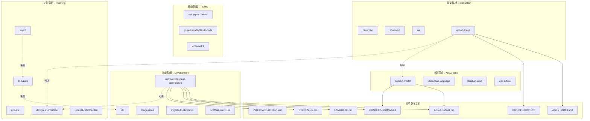
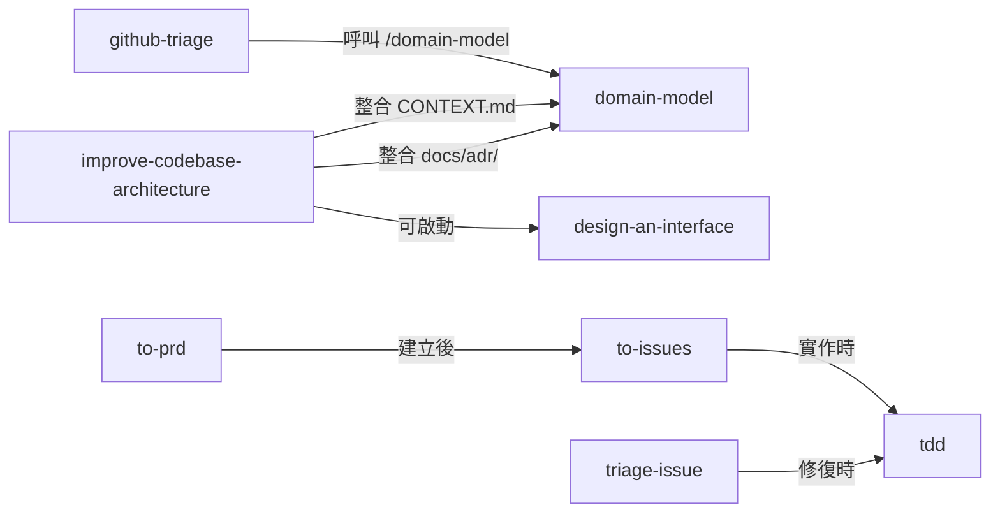

# CODEBASE_MAP.md — 程式碼地圖

## Annotated Directory Tree

```
mattpocock-skills/
│
├── README.md                    # 對外說明文件 + 所有技能清單與安裝指令
├── LICENSE                      # MIT 授權（Copyright © 2026 Matt Pocock）
│
├── caveman/
│   └── SKILL.md                 # 超壓縮溝通模式；觸發詞: "caveman", "less tokens", /caveman
│
├── design-an-interface/
│   └── SKILL.md                 # 平行 sub-agents 生成 3+ 種截然不同的介面設計
│
├── domain-model/
│   ├── SKILL.md                 # DDD 領域訪談；disable-model-invocation: true
│   ├── ADR-FORMAT.md            # ADR 格式規範（被 domain-model 和 improve-codebase-architecture 引用）
│   └── CONTEXT-FORMAT.md        # CONTEXT.md 格式規範（單一與多 context repo 的寫法）
│
├── edit-article/
│   └── SKILL.md                 # 文章分段、改寫、每段 ≤240 字元
│
├── git-guardrails-claude-code/
│   ├── SKILL.md                 # 安裝 PreToolUse hook 攔截危險 git 指令
│   └── scripts/
│       └── block-dangerous-git.sh  ← 唯一可執行程式碼；攔截 git push/reset --hard/clean 等
│
├── github-triage/
│   ├── SKILL.md                 # Label-based state machine 分類 GitHub Issues
│   ├── AGENT-BRIEF.md           # 如何寫 agent brief（durability 原則、模板）
│   └── OUT-OF-SCOPE.md          # .out-of-scope/ 知識庫格式說明
│
├── grill-me/
│   └── SKILL.md                 # 無情訪談（問題逐一問，不批量）；最受歡迎的技能
│
├── improve-codebase-architecture/
│   ├── SKILL.md                 # 找出架構深化機會（淺模組 → 深模組）
│   ├── DEEPENING.md             # 依賴分類（in-process/local-substitutable/remote/external）
│   ├── INTERFACE-DESIGN.md      # 平行 sub-agent 介面設計子流程（整合 design-an-interface 概念）
│   └── LANGUAGE.md              # 共用架構詞彙（Module/Interface/Seam/Adapter/Depth/Leverage）
│
├── migrate-to-shoehorn/
│   └── SKILL.md                 # 將測試中 `as Type` → fromPartial()，`as unknown as Type` → fromAny()
│
├── obsidian-vault/
│   └── SKILL.md                 # 搜尋/建立/管理 Obsidian 筆記（路徑 hardcode）
│
├── qa/
│   └── SKILL.md                 # 互動 QA 會話；背景 Explore agent；自動建立 GitHub Issues
│
├── request-refactor-plan/
│   └── SKILL.md                 # 詳細重構計畫 + tiny commits + 提交 GitHub Issue
│
├── scaffold-exercises/
│   └── SKILL.md                 # 建立 ai-hero.dev 課程練習目錄結構（problem/solution/explainer）
│
├── setup-pre-commit/
│   └── SKILL.md                 # Husky + lint-staged + Prettier；自動偵測 package manager
│
├── tdd/
│   ├── SKILL.md                 # RED-GREEN-REFACTOR 循環；垂直切片；不允許水平切片
│   ├── deep-modules.md          # 深度模組圖解（small interface + deep implementation）
│   ├── tests.md                 # 好/壞測試範例（integration-style vs implementation-coupled）
│   ├── mocking.md               # Mock 時機（system boundaries only）+ SDK-style interface
│   ├── interface-design.md      # 可測試介面：DI、回傳值、小介面
│   └── refactoring.md           # 重構候選：重複、長方法、淺模組、feature envy
│
├── to-issues/
│   └── SKILL.md                 # 計畫/PRD → tracer bullet 垂直切片 GitHub Issues
│
├── to-prd/
│   └── SKILL.md                 # 對話 context → PRD → GitHub Issue（不訪談，直接合成）
│
├── triage-issue/
│   └── SKILL.md                 # Bug 根因分析（Explore agent）+ TDD 修復計畫 GitHub Issue
│
├── ubiquitous-language/
│   └── SKILL.md                 # 萃取 DDD 通用語言 → UBIQUITOUS_LANGUAGE.md；disable-model-invocation: true
│
├── write-a-skill/
│   └── SKILL.md                 # 建立新技能的元技能（description 格式、progressive disclosure）
│
└── zoom-out/
    └── SKILL.md                 # 請 agent 提升抽象層次；disable-model-invocation: true
```

---

## 「我想做 X 要看哪裡？」速查表

| 我想要... | 看這裡 | 關鍵檔案 |
|-----------|--------|---------|
| 新增一個技能 | 根目錄（新建目錄） | `write-a-skill/SKILL.md`（設計指引） |
| 修改某個技能的觸發條件 | 對應技能目錄 | `<skill>/SKILL.md`（frontmatter description）|
| 禁止 Claude 自動觸發某技能 | 對應技能目錄 | `<skill>/SKILL.md`（加 `disable-model-invocation: true`）|
| 了解 SKILL.md 格式規範 | write-a-skill/ | `write-a-skill/SKILL.md` |
| 了解 ADR 格式 | domain-model/ | `domain-model/ADR-FORMAT.md` |
| 了解 CONTEXT.md 格式 | domain-model/ | `domain-model/CONTEXT-FORMAT.md` |
| 修改攔截的危險 git 指令 | git-guardrails-claude-code/scripts/ | `block-dangerous-git.sh`（DANGEROUS_PATTERNS 陣列）|
| 了解 agent brief 格式 | github-triage/ | `github-triage/AGENT-BRIEF.md` |
| 了解 out-of-scope 格式 | github-triage/ | `github-triage/OUT-OF-SCOPE.md` |
| 了解架構術語（Module/Seam/Adapter）| improve-codebase-architecture/ | `LANGUAGE.md` |
| 了解如何深化模組 | improve-codebase-architecture/ | `DEEPENING.md` |
| 了解好/壞測試的差異 | tdd/ | `tdd/tests.md` |
| 了解何時使用 Mock | tdd/ | `tdd/mocking.md` |
| 了解深度模組概念 | tdd/ | `tdd/deep-modules.md` |

---

## 模組依賴關係圖



### 技能間的 cross-reference 關係



---

## 參考文件從屬關係

| 參考文件 | 從屬技能 | 用途 |
|---------|---------|------|
| `domain-model/ADR-FORMAT.md` | `domain-model`、`improve-codebase-architecture` | ADR 格式規範 |
| `domain-model/CONTEXT-FORMAT.md` | `domain-model`、`improve-codebase-architecture` | CONTEXT.md 格式規範 |
| `improve-codebase-architecture/LANGUAGE.md` | `improve-codebase-architecture` | 共用架構詞彙 |
| `improve-codebase-architecture/DEEPENING.md` | `improve-codebase-architecture` | 深化流程與依賴分類 |
| `improve-codebase-architecture/INTERFACE-DESIGN.md` | `improve-codebase-architecture` | 介面設計子流程 |
| `github-triage/AGENT-BRIEF.md` | `github-triage` | Agent brief 撰寫指引 |
| `github-triage/OUT-OF-SCOPE.md` | `github-triage` | Out-of-scope 知識庫格式 |
| `tdd/deep-modules.md` | `tdd` | 深度模組概念 |
| `tdd/tests.md` | `tdd` | 好/壞測試範例 |
| `tdd/mocking.md` | `tdd` | Mock 使用指南 |
| `tdd/interface-design.md` | `tdd` | 可測試介面設計 |
| `tdd/refactoring.md` | `tdd` | 重構候選項目 |
| `git-guardrails-claude-code/scripts/block-dangerous-git.sh` | `git-guardrails-claude-code` | 危險 git 指令攔截腳本 |
