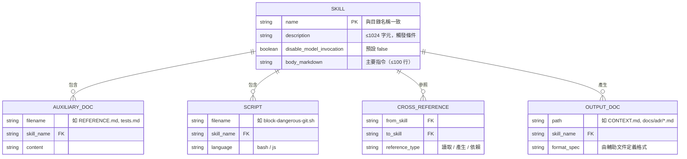
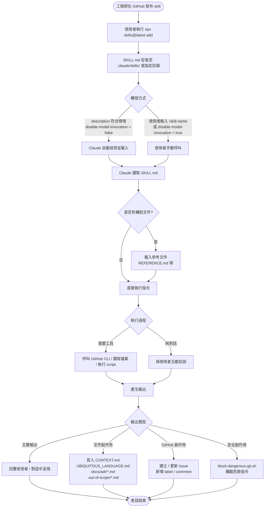
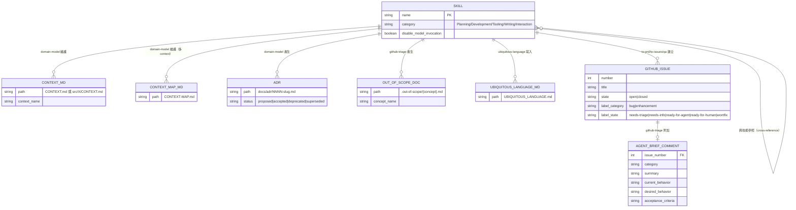

# DATA_MODEL.md — mattpocock-skills 資料模型

> 本文件描述 mattpocock-skills 專案中所有「資料」的結構與關係。此 repo 為純文件專案，「資料模型」涵蓋：Skill 格式、技能產生的次要文件、唯一可執行程式碼的輸入/輸出，以及技能的生命週期。

---

## 1. 核心資料結構：Skill（技能）

### 1.1 SKILL.md Schema

每個技能的核心是一個 Markdown 檔案，結合 YAML frontmatter 與 Markdown 指令正文。

#### Frontmatter 欄位

| 欄位 | 型別 | 必填 | 限制 | 說明 |
|------|------|------|------|------|
| `name` | `string` | 建議必填 | 必須與目錄名稱一致 | 技能的唯一識別符 |
| `description` | `string` | 建議必填 | ≤1024 字元 | Claude 自動載入的唯一判斷依據；格式：第一句說功能，第二句說 "Use when [triggers]" |
| `disable-model-invocation` | `boolean` | 選填，預設 `false` | — | `true` 代表僅允許使用者以 `/skill-name` 手動呼叫，禁止 Claude 自動載入 |

#### SKILL.md 正文結構（Template）

```markdown
---
name: skill-name
description: Brief description of capability. Use when [specific triggers].
---

# Skill Name

## Quick start
[最小可執行範例]

## Workflows
[分步驟流程，含 checklist]

## Advanced features
[連結至獨立參考文件，如 See [REFERENCE.md](REFERENCE.md)]
```

#### 正文的規範限制

- **主要指令**：SKILL.md 限制在 **100 行以內**
- **超過時**：抽取到同目錄下的獨立文件（`REFERENCE.md`、`EXAMPLES.md`、`scripts/`）
- **不得**放入時效性資訊（路徑、行號）

### 1.2 Skill ER 關係圖



---

## 2. 技能產生的次要文件格式

### 2.1 `CONTEXT.md`（由 `domain-model` 技能產生）

**路徑**：repo 根目錄（單一 context）或各子目錄（多 context）

```markdown
# {Context Name}

{一至兩句描述此 context 的目的。}

## Language

**Term**:
{一句話定義，描述它是什麼，而非它做什麼}
_Avoid_: synonym1, synonym2

## Relationships

- A **TermA** produces one or more **TermB**s
- A **TermB** belongs to exactly one **TermA**

## Example dialogue

> **Dev:** "..."
> **Domain expert:** "..."

## Flagged ambiguities

- "term" was used to mean both **X** and **Y** — resolved: ...
```

**多 context 時**，另有 `CONTEXT-MAP.md`，列出所有 context 路徑與上下游關係。

---

### 2.2 `UBIQUITOUS_LANGUAGE.md`（由 `ubiquitous-language` 技能產生）

**路徑**：working directory 根目錄

```markdown
# Ubiquitous Language

## {Subdomain Group}

| Term       | Definition                        | Aliases to avoid  |
| ---------- | --------------------------------- | ----------------- |
| **Term**   | 一句話定義                         | synonym1, synonym2 |

## Relationships

- A **TermA** belongs to exactly one **TermB**

## Example dialogue

> **Dev:** "..."
> **Domain expert:** "..."

## Flagged ambiguities

- "term" was used to mean both **X** and **Y** — ...
```

---

### 2.3 `docs/adr/*.md`（由 `domain-model`、`improve-codebase-architecture` 產生）

**路徑**：`docs/adr/0001-slug.md`（依序編號，懶惰建立目錄）

```markdown
# {Short title of the decision}

{1-3 句：context、決定內容、原因。}

<!-- 選填欄位（僅在確有需要時加入）: -->

**Status**: proposed | accepted | deprecated | superseded by ADR-NNNN

**Considered Options**:
- Option A — rejected because...

**Consequences**:
- Non-obvious downstream effect...
```

**觸發條件**（三項全中才建立 ADR）：
1. 難以反轉（有顯著改變成本）
2. 在無上下文時令人困惑
3. 確實做過取捨選擇

---

### 2.4 `.out-of-scope/*.md`（由 `github-triage` 技能產生）

**路徑**：`.out-of-scope/{concept-kebab-case}.md`（一個 concept 一個檔案）

```markdown
# {Concept Name}

{一到兩句：此專案不支援此功能。}

## Why this is out of scope

{敘述性段落，說明技術或策略原因，可含程式碼範例。}

## Prior requests

- #{issue_number} — "{issue_title}"
- #{issue_number} — "{issue_title}"
```

**規則**：
- 只針對 **enhancement** 被 `wontfix` 時產生（bug 不建立此文件）
- 同一 concept 的多個 issue 合併在同一檔案下的 "Prior requests"
- 理由必須實質性（不得使用暫時性原因如「我們現在太忙了」）

---

### 2.5 GitHub Issue 格式（多個技能的輸出模板）

各技能產生的 GitHub Issue 遵循以下共同結構：

| 技能 | Issue 用途 | 必填欄位 |
|------|-----------|---------|
| `to-prd` | PRD 文件 | 背景、目標、使用者故事、驗收標準 |
| `to-issues` | 垂直切片任務 | 標題（動詞開頭）、描述、驗收標準 |
| `triage-issue` | Bug 根因分析 + TDD 修復計畫 | 根因、復現步驟、修復計畫 |
| `request-refactor-plan` | 重構計畫（tiny commits） | 目標、每個步驟、驗證方式 |
| `qa` | QA 發現的 Bug | 問題描述、復現步驟、預期行為 |

**所有 `github-triage` 技能產生的 comment 必須加上 AI 免責聲明**：

```markdown
> *This was generated by AI during triage.*

[實際內容]
```

---

### 2.6 Agent Brief 格式（`github-triage` 產生的特殊 Issue comment）

當 Issue 移至 `ready-for-agent` 狀態時，`github-triage` 技能在 Issue 下發布 Agent Brief comment：

```markdown
> *This was generated by AI during triage.*

## Agent Brief

**Category:** bug | enhancement
**Summary:** 一行描述

**Current behavior:**
（現狀描述；bug 為錯誤行為，enhancement 為改變前的現況）

**Desired behavior:**
（目標行為，含邊界條件與錯誤情況）

**Key interfaces:**
- `TypeName` — 需要改變的原因
- `functionName()` — 目前回傳值 vs 應回傳值

**Acceptance criteria:**
- [ ] 可獨立驗證的具體條件 1
- [ ] 可獨立驗證的具體條件 2

**Out of scope:**
- 不應更動的相鄰功能
```

**Agent Brief 設計原則**：
- 不引用檔案路徑（會過時）
- 不引用行號（會過時）
- 描述行為契約，而非實作細節
- 使用 codebase 的領域語言

---

## 3. `block-dangerous-git.sh` 的資料結構

### 3.1 輸入：PreToolUse JSON Schema

Claude Code 在執行 Bash tool 之前，透過 `stdin` 傳入 JSON：

```json
{
  "tool_input": {
    "command": "git push origin main"
  }
}
```

| 欄位 | 型別 | 說明 |
|------|------|------|
| `tool_input` | `object` | Claude Code hook 的標準包裝物件 |
| `tool_input.command` | `string` | 使用者或 Claude 即將執行的 bash 指令 |

### 3.2 DANGEROUS_PATTERNS 陣列

Script 內建 9 個 Extended Regex 模式（`grep -qE`）：

| # | Pattern（原始字串） | 攔截目標 |
|---|-------------------|---------|
| 1 | `git push` | 所有 push 操作 |
| 2 | `git reset --hard` | 強制重置工作目錄 |
| 3 | `git clean -fd` | 強制刪除未追蹤檔案與目錄 |
| 4 | `git clean -f` | 強制刪除未追蹤檔案 |
| 5 | `git branch -D` | 強制刪除分支 |
| 6 | `git checkout \.` | 恢復工作目錄所有變更 |
| 7 | `git restore \.` | 恢復工作目錄所有變更（新語法）|
| 8 | `push --force` | force push（任何遠端） |
| 9 | `reset --hard` | 無 `git` 前綴的 reset |

### 3.3 輸出

| 情況 | stdout | stderr | exit code |
|------|--------|--------|-----------|
| 指令安全（無匹配） | — | — | `0`（Claude 繼續執行）|
| 指令危險（有匹配） | — | `BLOCKED: '{command}' matches dangerous pattern '{pattern}'. The user has prevented you from doing this.` | `2`（Claude 收到攔截信號）|

---

## 4. 技能的生命週期

### 4.1 流程圖



### 4.2 技能呼叫模式對比

| 屬性 | 自動觸發（Auto）| 手動呼叫（Manual）|
|------|---------------|-----------------|
| 觸發條件 | description 符合情境 | 使用者輸入 `/skill-name` |
| `disable-model-invocation` | `false`（預設）| `true` |
| 典型使用場景 | `tdd`、`github-triage`、`to-prd` | `domain-model`、`ubiquitous-language`、`zoom-out` |
| 副作用 | 通常為唯讀或輕量 | 通常寫入 codebase 文件 |

---

## 5. 技能分類的 ER 關係

### 5.1 Skill 與文件的完整關係



### 5.2 技能間的跨技能參照關係

| 來源技能 | 參照目標 | 參照類型 |
|---------|---------|---------|
| `improve-codebase-architecture` | `domain-model` 的 `CONTEXT.md` | 讀取（領域術語一致性）|
| `improve-codebase-architecture` | `domain-model` 的 `docs/adr/` | 讀取（架構決策）|
| `improve-codebase-architecture` | `design-an-interface` | 子流程呼叫 |
| `github-triage` | `.out-of-scope/` | 讀取並比對 |
| `triage-issue` | `tdd` | 概念引用（TDD 修復計畫）|
| `grill-me` | `domain-model` | 共享 Grilling Loop 模式 |

---

## 附錄：目錄快速參照

| 技能目錄 | 主要文件格式 | 副作用文件 |
|---------|------------|---------|
| `domain-model/` | CONTEXT.md 格式規範 | `CONTEXT.md`、`docs/adr/*.md` |
| `ubiquitous-language/` | — | `UBIQUITOUS_LANGUAGE.md` |
| `github-triage/` | Agent Brief、Out-of-scope 格式 | `.out-of-scope/*.md`、GitHub labels/comments |
| `git-guardrails-claude-code/` | — | PreToolUse hook（exit code）|
| `write-a-skill/` | SKILL.md 格式規範 | 新 `skill-name/SKILL.md` |
| `tdd/` | 測試、mock、重構參考文件 | — |
| `improve-codebase-architecture/` | LANGUAGE.md、DEEPENING.md | `docs/adr/*.md`（間接）|
