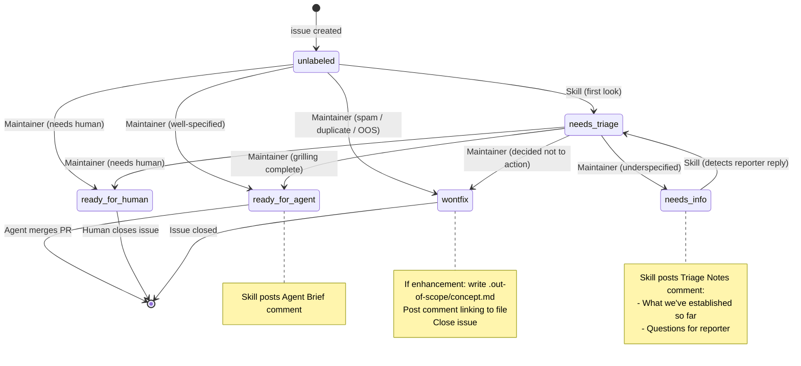
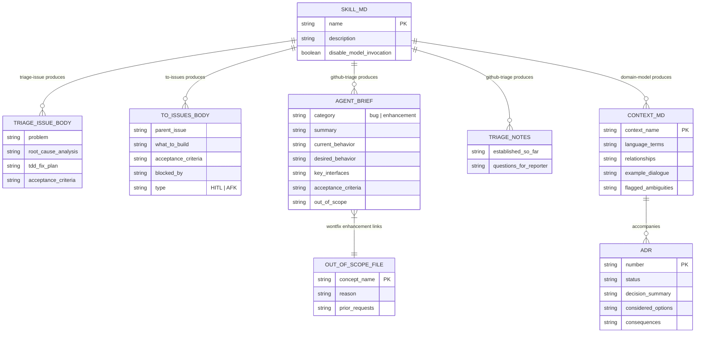

# DATA_MODEL.md — mattpocock/skills 資料模型

> 文件日期：2026-04-27
> 範圍：`/home/user/mattpocock-skills` 整個 repo 的概念資料結構

---

## 1. Skill 的資料結構

每個 skill 的核心是 `SKILL.md`，包含 YAML frontmatter 與指令正文。

### 1.1 SKILL.md Frontmatter 欄位

來源：`write-a-skill/SKILL.md:37-57`、各 skill 實際檔案

| 欄位 | 型別 | 必填 | 限制 | 說明 |
|------|------|------|------|------|
| `name` | string | ✅ | snake_case 或 kebab-case | Slash command 名稱，e.g. `github-triage` |
| `description` | string | ✅ | 最多 1024 字元 | Agent 選擇 skill 的依據；格式：「功能描述。Use when [觸發條件]」 |
| `disable-model-invocation` | boolean | ❌（預設 false） | — | 設為 `true` 時不發起新的 model call，純粹注入 context |

**`disable-model-invocation: true` 的 skill（共 3 個）：**
- `ubiquitous-language/SKILL.md`
- `zoom-out/SKILL.md`
- `domain-model/SKILL.md`（見 `domain-model/SKILL.md:5`）

### 1.2 Skill 目錄結構（規範）

來源：`write-a-skill/SKILL.md:26-34`

```
skill-name/
├── SKILL.md           # 主要指令（必填，< 100 行）
├── REFERENCE.md       # 詳細文件（可選）
├── EXAMPLES.md        # 使用範例（可選）
└── scripts/           # 工具腳本（可選）
    └── helper.sh
```

---

## 2. ER Diagram — 概念實體關係

```mermaid
erDiagram
    SKILL {
        string name PK
        string description
        boolean disable_model_invocation
        int line_count
    }

    SKILL_GROUP {
        string directory_name PK
        string primary_skill FK
    }

    REFERENCE_FILE {
        string file_path PK
        string skill_group FK
        string role "deep-modules | mocking | refactoring | interface-design | tests | DEEPENING | LANGUAGE | INTERFACE-DESIGN | ADR-FORMAT | CONTEXT-FORMAT | AGENT-BRIEF | OUT-OF-SCOPE"
    }

    UTILITY_SCRIPT {
        string file_path PK
        string skill_group FK
        string language "bash"
        string hook_type "PreToolUse"
    }

    HOOK {
        string name PK
        string type "PreToolUse | PostToolUse"
        string script_path FK
        int exit_code_block "2"
        int exit_code_allow "0"
    }

    GITHUB_ISSUE {
        string number PK
        string title
        string body
        string state "open | closed"
        string category_label "bug | enhancement"
        string state_label
    }

    LABEL {
        string name PK
        string type "Category | State"
    }

    AGENT_BRIEF {
        string issue_number FK
        string category "bug | enhancement"
        string summary
        string current_behavior
        string desired_behavior
        string key_interfaces
        string acceptance_criteria
        string out_of_scope
    }

    OUT_OF_SCOPE_FILE {
        string concept_name PK
        string file_path
        string decision
        string reason
        string prior_requests
    }

    CONTEXT_MD {
        string context_name PK
        string description
        string language_terms
        string relationships
        string example_dialogue
        string flagged_ambiguities
    }

    ADR {
        string number PK "e.g. 0001"
        string slug
        string status "proposed | accepted | deprecated | superseded"
        string decision_summary
        string considered_options
        string consequences
    }

    SKILL_GROUP ||--|| SKILL : "has primary"
    SKILL_GROUP ||--o{ REFERENCE_FILE : "bundles"
    SKILL_GROUP ||--o| UTILITY_SCRIPT : "contains"
    UTILITY_SCRIPT ||--o| HOOK : "registered as"
    GITHUB_ISSUE ||--o| AGENT_BRIEF : "has comment"
    GITHUB_ISSUE }o--|| LABEL : "has category"
    GITHUB_ISSUE }o--|| LABEL : "has state"
    GITHUB_ISSUE ||--o| OUT_OF_SCOPE_FILE : "wontfix triggers"
    CONTEXT_MD ||--o{ ADR : "accompanies"
```



---

## 3. GitHub Issue 資料模型

### 3.1 `triage-issue` 產出的 Issue 結構

來源：`triage-issue/SKILL.md:61-100`

```
## Problem
  actual_behavior   : string   — 實際發生的行為
  expected_behavior : string   — 應有的行為
  reproduction      : string?  — 重現步驟（若適用）

## Root Cause Analysis
  code_path         : string   — 涉及的程式碼路徑（以行為描述，不含檔案路徑）
  failure_reason    : string   — 為何現有程式碼失敗
  contributing_factors : string[]

## TDD Fix Plan
  cycles[]
    red             : string   — 測試描述（預期行為）
    green           : string   — 最小實作變更
  refactor          : string?  — 所有測試通過後的清理

## Acceptance Criteria
  criteria[]        : string[] — 可勾選清單項目
```

**重要約束**（`triage-issue/SKILL.md:76-77`）：  
Root Cause Analysis 不得包含具體檔案路徑、行號或實作細節。以行為、介面、契約描述。

### 3.2 `to-issues` 產出的 Issue 結構

來源：`to-issues/SKILL.md:56-77`

```
## Parent
  parent_issue      : string?  — #<issue-number>（若來源是 GitHub issue）

## What to build
  description       : string   — 垂直切片的端對端行為描述

## Acceptance criteria
  criteria[]        : string[] — 可勾選清單

## Blocked by
  blockers[]        : string[] — #<issue-number> 列表，或「None - can start immediately」
```

**Issue 類型**：
- `HITL`（Human-in-the-Loop）— 需要人工介入（架構決策、設計審查）
- `AFK`（Away From Keyboard）— 可由 agent 自行完成並合併

---

## 4. Agent Brief 資料模型

來源：`github-triage/AGENT-BRIEF.md:39-66`

Agent Brief 是 `ready-for-agent` 時張貼在 issue 的結構化 comment，是 AFK agent 的執行合約。

```
## Agent Brief

category          : "bug" | "enhancement"
summary           : string          — 一行描述

current_behavior  : string          — 現有行為（bugs: 壞掉的行為；enhancements: 現狀）
desired_behavior  : string          — 完成後的預期行為（含邊界情況與錯誤條件）

key_interfaces[]                    — TypeScript 型別/函式簽名（不含檔案路徑）
  - name          : string
  - change        : string

acceptance_criteria[]  : string[]   — 獨立可驗證的勾選項目

out_of_scope[]         : string[]   — 明確排除的項目
```

**設計原則**（`github-triage/AGENT-BRIEF.md:7-20`）：
- Durability over precision — 描述介面與行為契約，不引用檔案路徑或行號
- Behavioral, not procedural — 描述「what」，不描述「how」

所有 GitHub comment（包含 Agent Brief）頭部必須加入 AI 免責聲明（`github-triage/SKILL.md:12-16`）：
```
> *This was generated by AI during triage.*
```

---

## 5. Label 狀態機資料模型

來源：`github-triage/SKILL.md:25-51`

### 5.1 Label 定義

| Label | Type | 說明 |
|-------|------|------|
| `bug` | Category | 某功能損壞 |
| `enhancement` | Category | 新功能或改善 |
| `needs-triage` | State | 維護者需要評估 |
| `needs-info` | State | 等待回報者提供更多資訊 |
| `ready-for-agent` | State | 已完整規格化，可供 AFK agent 執行 |
| `ready-for-human` | State | 需要人工實作 |
| `wontfix` | State | 不予處理 |

**約束**：每個 issue 應恰好有一個 State label 和一個 Category label。

### 5.2 Label 狀態機圖（State Diagram）



---

## 6. CONTEXT.md 資料模型

來源：`domain-model/CONTEXT-FORMAT.md`、`domain-model/SKILL.md:16-47`

### 6.1 單一 Context 結構

```
# {Context Name}
  description       : string          — 1-2 句說明此 context 的目的

## Language
  terms[]
    name            : string          — 規範術語（加粗顯示）
    definition      : string          — 一句話定義（is what，不是 does what）
    avoid[]         : string[]        — 應避免使用的同義詞 / 別名

## Relationships
  relationships[]   : string[]        — 以加粗術語表達的關係陳述，含基數

## Example dialogue
  dialogue          : string          — Dev 與 Domain Expert 的對話範例

## Flagged ambiguities
  ambiguities[]     : string[]        — 曾有歧義的術語與解決結果
```

### 6.2 多 Context Repo（CONTEXT-MAP.md）

```
# Context Map
  contexts[]
    name            : string
    path            : string          — 指向各 CONTEXT.md 的路徑
    description     : string

  relationships[]   : string[]        — Context 之間的互動（事件、共享型別）
```

**檔案位置規則**：
- 單一 context → repo root 的 `CONTEXT.md`
- 多個 context → root 的 `CONTEXT-MAP.md` + 各子目錄的 `CONTEXT.md`
- 惰性建立（lazy creation）— 第一個術語確定後才建立檔案

---

## 7. ADR 資料模型

來源：`domain-model/ADR-FORMAT.md`

### 7.1 欄位結構

```
檔名格式: docs/adr/{NNNN}-{slug}.md
           e.g. docs/adr/0001-event-sourced-orders.md

---（可選 frontmatter）
status: "proposed" | "accepted" | "deprecated" | "superseded by ADR-NNNN"
---

# {Short title}

{1-3 sentences: context + decision + why}

## Considered Options（可選）
  options[]         : string[]        — 被拒絕的替代方案（非顯然時才記錄）

## Consequences（可選）
  consequences[]    : string[]        — 非顯然的下游影響
```

### 7.2 ADR 觸發條件（三個條件須同時成立）

來源：`domain-model/ADR-FORMAT.md:30-37`

1. **Hard to reverse** — 改變心意的成本有意義
2. **Surprising without context** — 未來讀者會納悶「為什麼這樣做？」
3. **The result of a real trade-off** — 存在真實替代方案且選擇有具體理由

---

## 8. `.out-of-scope/` 資料模型

來源：`github-triage/OUT-OF-SCOPE.md`

```
目錄：.out-of-scope/
  (位於被 triage 的目標 repo 中，非本 skills repo)

每個檔案對應一個「概念」（非一個 issue）
檔名：{concept-name}.md  — kebab-case，e.g. dark-mode.md

---
# {Concept Name}

intro             : string            — 說明此概念不在 scope 內的一句話

## Why this is out of scope
  reason          : string            — 具體原因（參照技術限制/專案哲學/策略決策）
  可含 code block 說明當前介面設計

## Prior requests
  requests[]      : string[]          — 格式：「- #{number} — "{issue title}"」
```

**觸發條件**：僅限 enhancement（非 bug）被標記為 `wontfix` 時建立。

**查詢規則**：Triage 階段讀取所有 `.out-of-scope/*.md`，以**概念相似度**比對（非關鍵字），例如「night theme」匹配 `dark-mode.md`。

---

## 9. 資料結構全覽（Summary Diagram）



---

## 附錄：欄位約束速查表

| 資料結構 | 欄位 | 約束 |
|----------|------|------|
| SKILL.md | `description` | max 1024 chars（`write-a-skill/SKILL.md:71`） |
| SKILL.md | `name` | 對應 slash command，需唯一 |
| SKILL.md | SKILL.md 本身 | 建議 < 100 行（`write-a-skill/SKILL.md:103`） |
| Agent Brief | 檔案路徑 / 行號 | ⛔ 禁止引用（`AGENT-BRIEF.md:13-15`） |
| ADR | 檔名 | `{NNNN}-{slug}.md`，流水號遞增 |
| `.out-of-scope/` | 觸發條件 | 僅 enhancement wontfix（`OUT-OF-SCOPE.md:86`） |
| CONTEXT.md | 術語定義 | 一句話、描述「is what」不是「does what」（`CONTEXT-FORMAT.md:42`） |
| GitHub Issue | State label | 同時間只能有一個（`SKILL.md:35`） |
| GitHub Issue | AI Disclaimer | 所有 triage comment 頭部必填（`SKILL.md:12-16`） |
