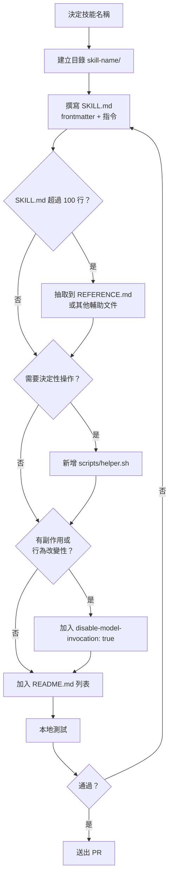

# 開發者上手指南 — mattpocock/skills

> Agent Skills For Real Engineers. 本指南說明如何在本地開發、新增技能，以及向此 repo 貢獻。

---

## 1. Prerequisites 與環境建置

### 本 repo 無需 Node.js 或 build system

此 repo 本身沒有 `package.json`、沒有 build 流程、沒有 runtime code（唯一的例外是一個 bash script）。你不需要執行 `npm install` 或任何編譯步驟。

### 必要工具

| 工具 | 用途 | 安裝方式 |
|------|------|---------|
| Claude Code CLI | 執行與測試技能的主要平台 | [code.claude.com](https://code.claude.com) |
| `skills` npm CLI | 將技能安裝至目標專案 | `npm install -g skills` 或直接用 `npx` |
| Git | 版本控管 | 系統預裝 |
| `jq` | 供 `block-dangerous-git.sh` 解析 JSON | `brew install jq` / `apt install jq` |

`skills` CLI 由 Vercel Labs 維護，官方網站為 [skills.sh](https://skills.sh)。

### 在目標專案安裝技能

```bash
# 安裝單一技能（專案範圍，寫入 .claude/skills/）
npx skills@latest add mattpocock/skills/tdd

# 安裝至全域（寫入 ~/.claude/skills/）
npx skills@latest add mattpocock/skills/tdd --global

# 列出此 collection 所有可用技能
npx skills add mattpocock/skills --list
```

安裝後，技能的所有檔案（SKILL.md 及輔助文件）會被複製至目標路徑，Claude Code 會在 session 啟動時自動載入。

---

## 2. 本地開發 Workflow

### Clone Repo

```bash
git clone https://github.com/mattpocock/skills.git
cd skills
```

### 目錄結構

```
skills/
├── README.md                    # 專案說明與所有技能列表
├── LICENSE                      # MIT 授權
├── <skill-name>/                # 每個技能一個目錄（扁平結構）
│   ├── SKILL.md                 # 必要：frontmatter + 指令（主體）
│   ├── REFERENCE.md             # 選填：詳細文件（當 SKILL.md 超過 100 行時）
│   └── scripts/                 # 選填：bash script（當操作具決定性時）
│       └── helper.sh
└── .trace/                      # 本 repo 的開發/分析文件（非技能）
```

各技能目錄之間**彼此獨立**，沒有共用 runtime 依賴。

### 修改現有技能

1. 直接編輯目標技能的 `SKILL.md`
2. 若有輔助文件（如 `tdd/tests.md`），一併更新
3. 測試方式見第 4 節

### 在 Claude Code 中載入自訂（本地）技能

Claude Code 可以直接從本地路徑載入技能。在你的 `.claude/settings.json` 中加入：

```json
{
  "skillPaths": [
    "/path/to/your/local/skills/clone/<skill-name>"
  ]
}
```

或使用 `skills` CLI 從本地路徑安裝（指向你 clone 的目錄）：

```bash
npx skills@latest add /path/to/local/skills/<skill-name>
```

修改後需重新安裝（重新複製）或讓 Claude Code 重新載入設定。

### Commit 慣例

根據 git log 歸納，此 repo 採用**祈使句英文 + 簡明描述**的風格：

| 類型 | 範例 commit message |
|------|-------------------|
| 新增技能 | `Added domain-model, updates to github-triage, and caveman` |
| 更新說明 | `Revise README.md to clarify the purpose of agent skills` |
| 重新命名 | `Rename skills for clarity: update 'write-a-prd' to 'to-prd'` |
| 文件強化 | `Enhance documentation in DEEPENING.md and INTERFACE-DESIGN.md` |
| 術語修正 | `Update terminology in SKILL.md: replace 'X' with 'Y' for consistency` |

**慣例規則**：
- 第一行 ≤ 72 字元
- 動詞開頭（Added / Update / Revise / Enhance / Clarify）
- 若有多個修改對象，在同一行用逗號列舉

---

## 3. 新增技能 Step-by-Step 指南

### 流程圖



### Step 1：建立目錄

目錄名稱即技能名稱，使用 kebab-case：

```bash
mkdir my-new-skill
```

### Step 2：撰寫 SKILL.md

使用以下模板：

```markdown
---
name: my-new-skill
description: >
  [第一句：說明此技能做什麼。]
  [第二句：Use when [具體觸發情境或關鍵詞].]
---

# My New Skill

## Quick start

[最小可用範例，讓 Claude 立刻可以執行]

## Workflows

[step-by-step 流程，複雜任務使用 checklist]

## Advanced features

[連結到輔助文件：See [REFERENCE.md](REFERENCE.md)]
```

### Step 3：撰寫 description

`description` 是 Claude 判斷**是否自動載入此技能的唯一依據**，請格外注意：

- **上限 1024 字元**，超過會被截斷
- 以第三人稱撰寫
- 第一句：說明能力（what it does）
- 第二句固定格式：`Use when [具體觸發詞/情境]`
- 包含能區分此技能與其他技能的關鍵詞

**好的範例：**
```
Extract DDD ubiquitous language glossary from conversations and codebase.
Use when user mentions domain model, ubiquitous language, bounded context, or wants to document terminology.
```

**不好的範例：**
```
Helps with terminology.
```

### Step 4：判斷是否需要輔助文件

| 情況 | 做法 |
|------|------|
| `SKILL.md` 超過 100 行 | 抽取到 `REFERENCE.md`、`EXAMPLES.md` 等 |
| 內容有明確的子領域區分 | 各建一份文件（如 `tdd/tests.md`、`tdd/mocking.md`） |
| 進階功能很少被用到 | 放到獨立文件，在 SKILL.md 中 link |

輔助文件放在**同一技能目錄下**，在 SKILL.md 中以相對路徑連結：
```markdown
See [REFERENCE.md](REFERENCE.md) for detailed schema.
```

### Step 5：判斷是否需要 `disable-model-invocation: true`

以下情況應加入此 frontmatter key：

| 情況 | 說明 |
|------|------|
| 技能會**寫入/修改檔案**（有副作用） | 如 `domain-model`（更新 CONTEXT.md）、`ubiquitous-language` |
| 技能會**改變 agent 行為模式** | 如 `zoom-out`（提升抽象層次） |
| 技能應**只由使用者主動呼叫** | 任何你不希望 Claude 自動判斷觸發的技能 |

加入後，使用者必須明確輸入 `/my-new-skill` 才能觸發。

### Step 6：判斷是否需要 bash script

以下情況需要新增 `scripts/` 目錄並撰寫 bash script：

- 操作是**決定性的**（deterministic）：相同輸入總是相同輸出（驗證、格式化）
- 相同程式碼**每次都會重複生成**（浪費 token）
- 操作**需要明確的錯誤處理**

範例：`git-guardrails-claude-code/scripts/block-dangerous-git.sh` 攔截 Claude 的 Bash tool 呼叫，符合以上三點。

Script 的呼叫方式在 SKILL.md 中說明，讓 Claude 知道如何執行它。

### Step 7：更新 README.md

在 `/home/user/mattpocock-skills/README.md` 中的對應分類下新增技能的 bullet point：

```markdown
- **my-new-skill** — 一句話說明用途。

  ```
  npx skills@latest add mattpocock/skills/my-new-skill
  ```
```

---

## 4. 測試技能的方式

**此 repo 沒有自動化測試套件。** 所有測試均為手動驗證。

### 在 Claude Code 中手動測試

1. 將技能安裝至測試專案：
   ```bash
   npx skills@latest add /path/to/local/skills/my-new-skill
   ```
2. 開啟 Claude Code，在 session 中輸入 `/my-new-skill`
3. 確認 Claude 是否按照 SKILL.md 的指令執行

### 確認 description 觸發條件

若技能**未設定** `disable-model-invocation: true`，需測試 Claude 是否在適當情境下**自動**載入：

1. 在 Claude Code session 中，以自然語言描述目標情境（不直接輸入 `/skill-name`）
2. 確認 Claude 是否自動使用該技能
3. 若未觸發，檢查 description 中的觸發詞是否夠清晰

### 驗證輔助文件連結

若技能包含輔助文件，確認：
- SKILL.md 中的相對路徑正確（如 `[REFERENCE.md](REFERENCE.md)`）
- 安裝後目標目錄下有對應檔案

```bash
ls ~/.claude/skills/my-new-skill/
# 應看到 SKILL.md 以及所有輔助文件
```

### 驗證 bash script

若有 `scripts/`，手動執行測試：

```bash
echo '{"tool_input":{"command":"git push origin main"}}' | ./scripts/block-dangerous-git.sh
# 應 exit 2 並印出 BLOCKED 訊息
```

---

## 5. Debugging 技巧與常見踩坑

### description 超過 1024 字元 → 被截斷

**症狀**：Claude 無法正確判斷何時載入技能，或觸發條件不穩定。

**解決**：計算 description 字元數，確保不超過 1024。可使用：
```bash
wc -m <<< "your description here"
```

### name 與目錄名稱不一致 → 技能無法載入

**症狀**：`/skill-name` 指令無回應，或 Claude 找不到技能。

**規則**：frontmatter 中的 `name` 必須與目錄名稱**完全一致**。

```yaml
# 目錄：my-new-skill/
# frontmatter 必須是：
name: my-new-skill  # 正確
name: myNewSkill    # 錯誤，大小寫不符
name: my_new_skill  # 錯誤，底線而非連字號
```

### SKILL.md 超過 100 行 → 拆分至輔助文件

**症狀**：Claude 讀取 SKILL.md 時 context 過重，或指令結構不清晰。

**解決**：將進階功能、詳細參考資料、範例移至獨立的 `REFERENCE.md`，保持 SKILL.md 精簡（Quick start + Workflows）。

### 遺漏 `disable-model-invocation` → 有副作用的技能意外自動觸發

**症狀**：Claude 在未經明確指示的情況下開始修改 CONTEXT.md、建立 ADR，或改變對話模式。

**解決**：對所有「寫入檔案」或「改變 agent 行為」的技能，加入：
```yaml
disable-model-invocation: true
```

### `obsidian-vault` 路徑問題

`obsidian-vault/SKILL.md` 中 hardcode 了 Matt Pocock 的個人路徑：
```
/mnt/d/Obsidian Vault/AI Research/
```

安裝後需**手動修改**為你自己的 Obsidian Vault 路徑。這個問題設計上是刻意的（個人化設定），非 bug。

### bash script 權限問題

安裝 bash script 後需手動賦予執行權限：
```bash
chmod +x .claude/hooks/block-dangerous-git.sh
```

忘記此步驟會導致 hook 無法執行（silent fail）。

### 技能安裝後未更新

`skills` CLI 安裝是**複製行為**，之後修改本地 repo 不會自動同步。需重新執行安裝指令覆蓋：
```bash
npx skills@latest add mattpocock/skills/my-new-skill
```

---

## 6. Contribution Workflow

### 貢獻模式：Fork + PR

此 repo 採用標準 GitHub Fork-and-PR 流程，沒有額外的 CI/CD 或自動化測試：

```bash
# 1. Fork 並 clone
git clone https://github.com/<your-username>/skills.git
cd skills

# 2. 建立 feature branch
git checkout -b add-my-new-skill

# 3. 開發（見第 3 節）
mkdir my-new-skill
# ... 撰寫 SKILL.md 等

# 4. Commit
git add my-new-skill/
git commit -m "Add my-new-skill for [用途說明]"

# 5. Push 並開 PR
git push origin add-my-new-skill
gh pr create --title "Add my-new-skill" --body "..."
```

### PR 命名慣例

根據現有 commit history 歸納的 PR title 格式：

| 操作 | 格式 |
|------|------|
| 新增技能 | `Add <skill-name> skill` |
| 更新現有技能 | `Update <skill-name>: [簡短說明]` |
| 修正術語 | `Update terminology in <file>: replace 'X' with 'Y'` |
| 文件強化 | `Enhance <file> for clarity and consistency` |
| 重新命名 | `Rename <old> to <new> for clarity` |

### 無 CI/CD

此 repo **沒有**：
- 自動化測試
- Lint 檢查
- PR review bot
- 發布流程（無 npm publish，技能透過 `skills` CLI 直接從 GitHub 讀取）

所有品質控管依賴人工 review。

### 授權

本專案採用 **MIT License**（Copyright © 2026 Matt Pocock）。貢獻者提交 PR 即表示同意以 MIT 授權發布。

---

## 附錄：技能一覽

| 技能 | 功能 | disable-model-invocation |
|------|------|:---:|
| `caveman` | 超壓縮溝通模式，削減 ~75% token | - |
| `design-an-interface` | 平行 sub-agents 生成多種介面設計 | - |
| `domain-model` | DDD 領域模型訪談 + CONTEXT.md 維護 | **true** |
| `edit-article` | 文章重構與改善 | - |
| `git-guardrails-claude-code` | 攔截危險 git 指令 | - |
| `github-triage` | GitHub Issue label-based 狀態機分類 | - |
| `grill-me` | 無情訪談，解決決策樹每個分支 | - |
| `improve-codebase-architecture` | 找出架構深化機會（含 DDD awareness）| - |
| `migrate-to-shoehorn` | 將測試 `as` 替換為 shoehorn | - |
| `obsidian-vault` | 管理 Obsidian 筆記（需修改路徑）| - |
| `qa` | 互動式 QA + 自動建立 GitHub Issues | - |
| `request-refactor-plan` | 建立重構計畫並提交為 Issue | - |
| `scaffold-exercises` | 建立課程練習目錄結構 | - |
| `setup-pre-commit` | Husky + lint-staged + Prettier hooks | - |
| `tdd` | TDD red-green-refactor 垂直切片 | - |
| `to-issues` | 計畫拆解為 tracer bullet GitHub Issues | - |
| `to-prd` | 對話轉為 PRD + GitHub Issue | - |
| `triage-issue` | Bug 根因分析 + TDD 修復計畫 | - |
| `ubiquitous-language` | 萃取 DDD 通用語言至 UBIQUITOUS_LANGUAGE.md | **true** |
| `write-a-skill` | 建立新技能的元技能 | - |
| `zoom-out` | 讓 agent 提升抽象層次 | **true** |
